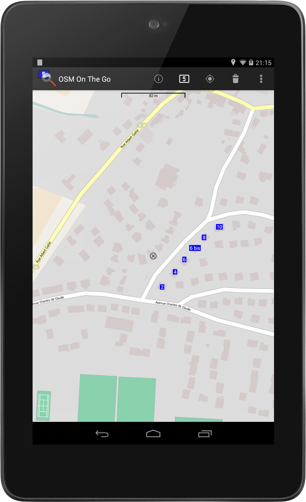
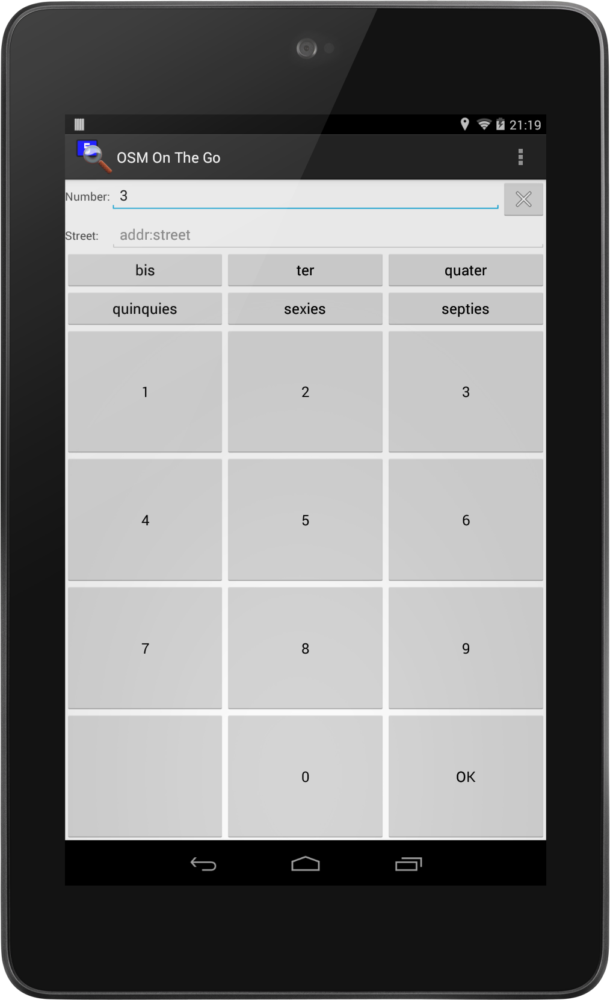
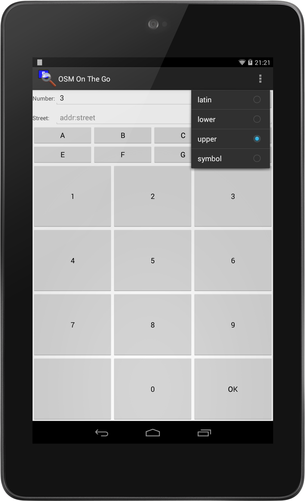
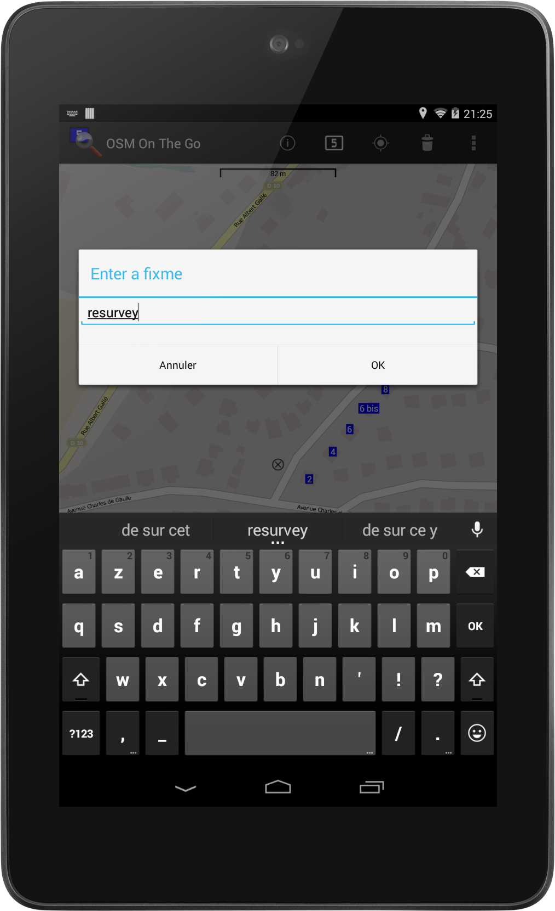

OSM On The Go
=============

A quick and easy way to take notes for [OpenStreetMap](https://www.openstreetmap.org/)
on your Android device while walking around.

Main features:

  * Big numeric keypad to enter addresses;
  * Several overlays to focus on missing or potentially incorrect data;
  * Share data with Drive, Mail, Wuala... 

